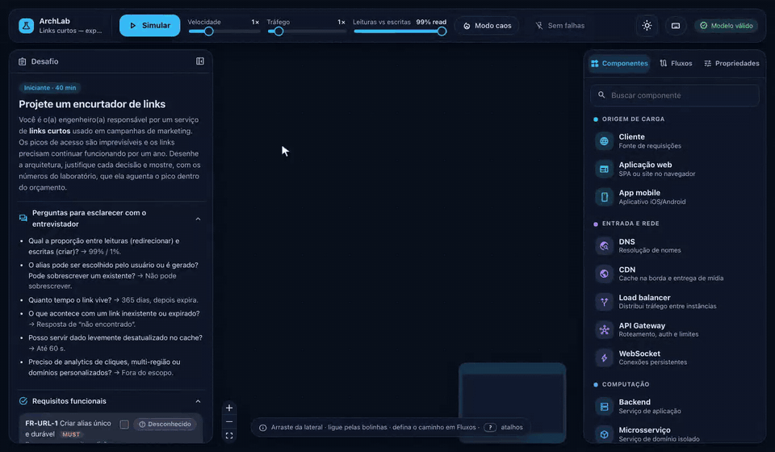
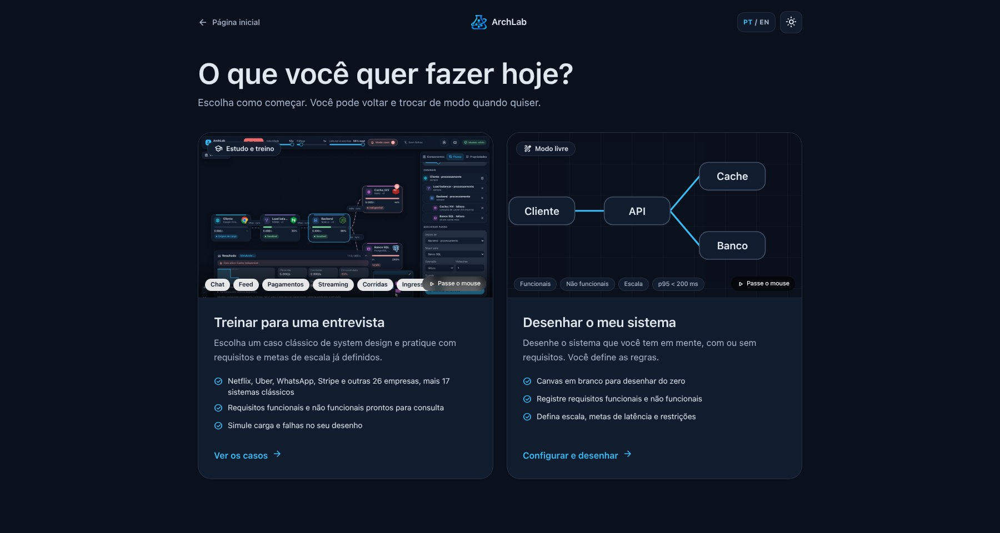
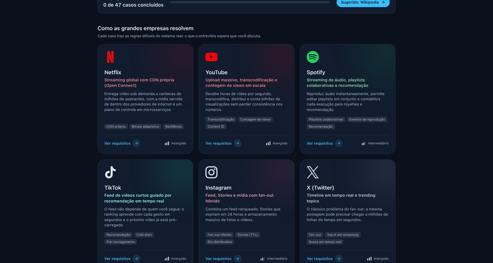
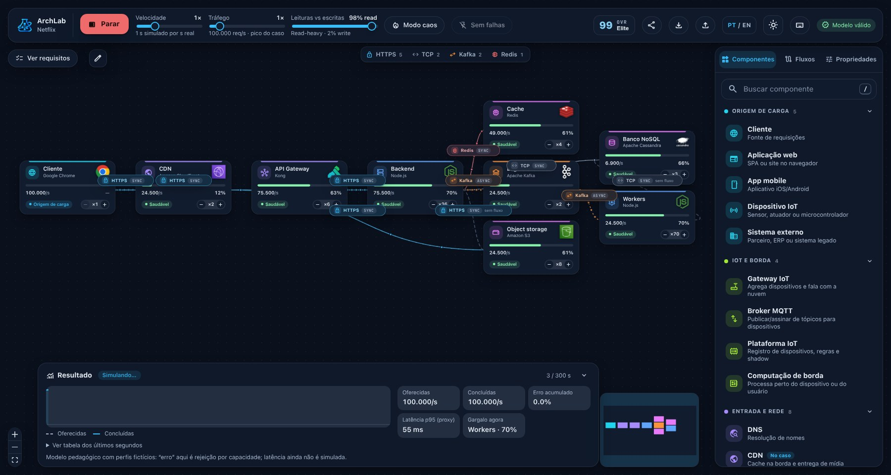
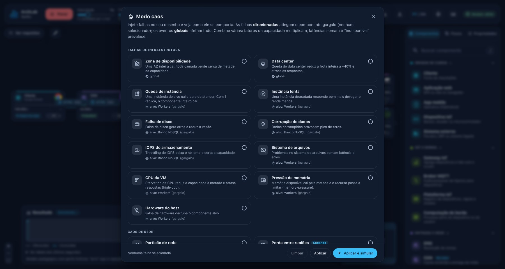
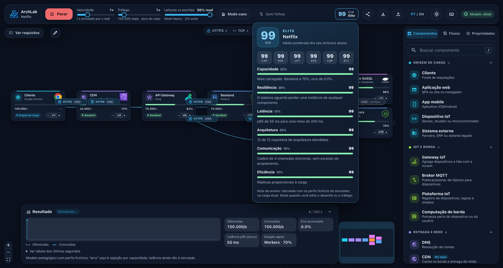
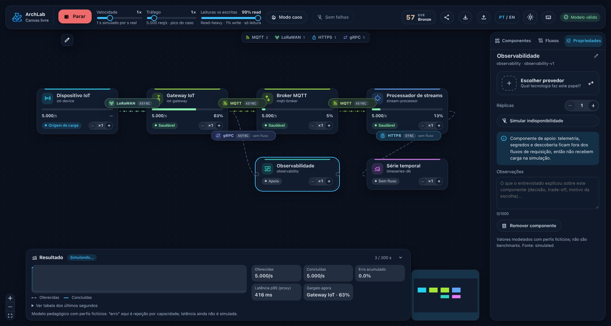
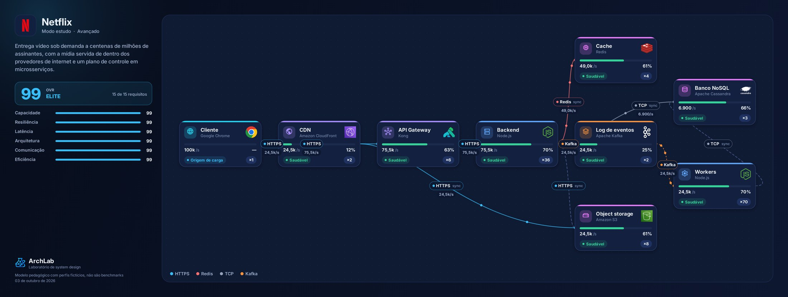
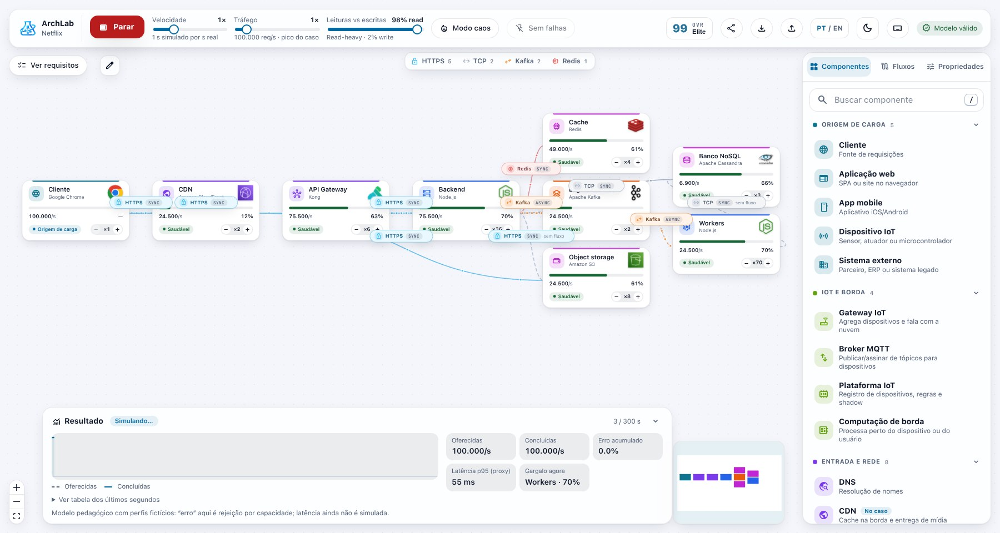

<div align="center">


# ArchLab

**Desenhe a arquitetura. Simule a carga. Quebre o sistema. Receba a nota.**

Laboratório visual de System Design para estudar, treinar entrevistas e discutir arquitetura com times.

[](https://archlab-six.vercel.app)


[**Experimentar agora →**](https://archlab-six.vercel.app) · [English](README.en.md) · [Arquitetura](docs/ARQUITETURA.md) · [Como estender](docs/EXTENDENDO.md)

<br />



</div>

---

## Por que existe

Materiais de System Design ensinam padrões, mas raramente deixam você **experimentar**: o que acontece quando o cache cai, quando o tráfego dobra, quando uma instância some? Diagramas bonitos escondem gargalos.

O ArchLab é o contrário: você desenha, e o sistema **responde com números**. Utilização por componente, latência p95, fila acumulando, falha injetada, e uma nota que explica *onde* você perdeu pontos e *o que* fazer.

> Sem backend, sem conta, sem coleta de dados. Tudo roda no navegador e fica salvo nele.

## Dois jeitos de usar

<table>
<tr>
<td width="50%" valign="top">

### Modo estudo / entrevista

Escolha um caso e resolva como numa entrevista: requisitos funcionais e não funcionais, escala, metas e perguntas típicas. O laboratório **verifica o seu desenho contra os requisitos** em tempo real. Quando quiser, compare com uma **solução de referência**.

**30 empresas** — Netflix, Spotify, Uber, WhatsApp, Nubank, Pix, Itaú, Shopee, Free Fire, Mercado Livre, Stripe, Discord… — e **17 clássicos** (encurtador de links, rate limiter, chat, feed, pagamentos…).

</td>
<td width="50%" valign="top">

### Modo livre

Canvas em branco para qualquer sistema, com **os seus** requisitos. Ideal para desenhar a arquitetura que você está defendendo no trabalho e ver se ela aguenta.

Os fluxos de requisição são **derivados das conexões** que você desenha: ligou, aparece. Sem editar passo a passo.

</td>
</tr>
</table>

<p align="center"></p>
<p align="center"></p>

## Simule, quebre, analise

<p align="center"></p>

- **Carga e utilização** em cada componente, **latência p95**, rejeição por capacidade e **backlog de filas**.
- **Tráfego animado** nas conexões, coloridas por protocolo; passe o mouse na legenda e só aquele protocolo fica em foco.
- **Modo caos:** derrube uma zona, corte a rede entre dois serviços, degrade o banco, estoure o tráfego 10× ou 100×. Cada caso sugere as falhas que mais importam nele.
- **Réplicas** direto no card, com o efeito aparecendo na hora.

<p align="center"></p>

## A nota geral (OVR)

Inspirada nos atributos de um card de jogo: **seis atributos** com peso, explicação e uma dica de como melhorar. Nada de nota misteriosa.

| Atributo | Peso | Mede |
| --- | :-: | --- |
| Capacidade | 25% | o componente mais carregado e a taxa de erro |
| Resiliência | 20% | derruba uma instância de cada componente do fluxo, uma de cada vez, e mede o estrago |
| Arquitetura | 20% | requisitos do caso atendidos (componentes e caminhos) ou boas práticas no modo livre |
| Latência | 15% | p95 contra a meta do caso |
| Comunicação | 10% | cadeias síncronas longas, fan-out alto, entrada sem TLS |
| Eficiência | 10% | réplicas ociosas |

Faixas: **Bronze → Prata → Ouro → Elite**. Sem dados suficientes, o app diz "sem nota" em vez de inventar um número. A melhor nota de cada caso fica guardada e aparece nos cartões.

<p align="center"></p>

## Um catálogo que cobre o mercado (e IoT)

**Cerca de 50 componentes** com provedores e logos reais, para desenhar sistemas de verdade:

| | |
| --- | --- |
| **Origem de carga** | cliente, app web e mobile, dispositivo IoT, sistema externo |
| **IoT e borda** | gateway IoT, broker MQTT, plataforma IoT, computação de borda |
| **Rede e entrada** | DNS, CDN, load balancer, API gateway, WAF, service mesh, rate limiter, WebSocket |
| **Computação** | backend, microsserviço, worker, Docker, Kubernetes, serverless, VM, cron, workflows, stream e batch, ML |
| **Dados** | SQL, NoSQL, cache, object storage, busca, série temporal, grafo, vetorial, data warehouse |
| **Mensageria** | Kafka, filas, MQTT, barramento de eventos |
| **Apoio** | autenticação, notificações, segredos, descoberta de serviços, observabilidade, pagamentos, APIs de terceiros |

E **20 protocolos** como cidadãos de primeira classe: HTTPS, gRPC, GraphQL, MQTT, CoAP, AMQP, Kafka, WebSocket, SQL, Redis, LoRaWAN, BLE, Modbus, OPC UA… cada um com cor, semântica síncrona/assíncrona e latência própria. Banco e cache também são origem de conexão (replicação, CDC, carga de cache).

<p align="center">

</p>
<p align="center"><sub>Pipeline IoT: LoRaWAN do sensor ao gateway, MQTT até o broker e o processador. A latência alta do LoRaWAN aparece no p95.</sub></p>

## Leve o resultado para a entrevista (e para o LinkedIn)

Um clique em **Exportar → Relatório em imagem** gera um PNG com o logo do caso, a nota, os requisitos e o **mapa completo** do que você desenhou: componentes, provedores, protocolos, utilização e vazão por conexão.

<p align="center"></p>

Durante a conversa, anote em cada componente o que o entrevistado explicou, e no lápis do canvas o que o entrevistador pediu para ajustar. As notas ficam salvas junto do desenho.

Também dá para **compartilhar por link**, **exportar/importar `.json`**, **desfazer/refazer** e usar atalhos de teclado.

## Feito com cuidado

- **Núcleo puro e determinístico** (`packages/domain`): mesma entrada, mesmo resultado. Sem I/O, sem aleatoriedade.
- **Cada caso é testado:** a solução de referência precisa atender os próprios requisitos, e os textos precisam estar traduzidos.
- **320+ testes**: unitários (vitest) e de ponta a ponta num Chromium real (Playwright), com **axe** conferindo acessibilidade nos dois temas. Cada teste falha se a página lançar erro de JavaScript.
- **PT/EN** completos, **tema claro e escuro**, responsivo, respeita "reduzir movimento".

<p align="center"></p>

## Rodando localmente

Requisitos: Node 20+ e [pnpm](https://pnpm.io).

```bash
pnpm install
pnpm --filter @archlab/web dev      # http://localhost:5173
```

| Comando | O que faz |
| --- | --- |
| `pnpm --filter @archlab/web build` | build estático em `apps/web/dist` |
| `pnpm typecheck` | TypeScript em todos os pacotes |
| `pnpm test` | testes unitários |
| `pnpm e2e` | testes de ponta a ponta ([como rodar](e2e/README.md)) |

## Estrutura

```
apps/web/            app React + Vite (landing, escolha de modo, laboratório)
packages/domain/     núcleo: schema, validação, conexões, perfis, demanda e utilização
e2e/                 testes de ponta a ponta (Playwright + axe)
docs/                arquitetura, como estender, publicar, créditos e ADRs
```

Quer adicionar um componente, um protocolo ou um caso de empresa? Veja [Como estender](docs/EXTENDENDO.md). Quer publicar a sua cópia? Veja [Publicar](docs/PUBLICAR.md).

## Aviso

Os números do simulador usam **perfis fictícios de ensino**: não são benchmarks de produção. As arquiteturas dos casos são **inspiradas em material público** e simplificadas; não representam os sistemas reais das empresas. Nomes e logos pertencem aos seus donos e são usados só para identificação e fins educacionais ([créditos](docs/CREDITOS.md)).

<div align="center"><sub>Feito por <a href="https://github.com/tiagomeconi">@tiagomeconi</a></sub></div>
